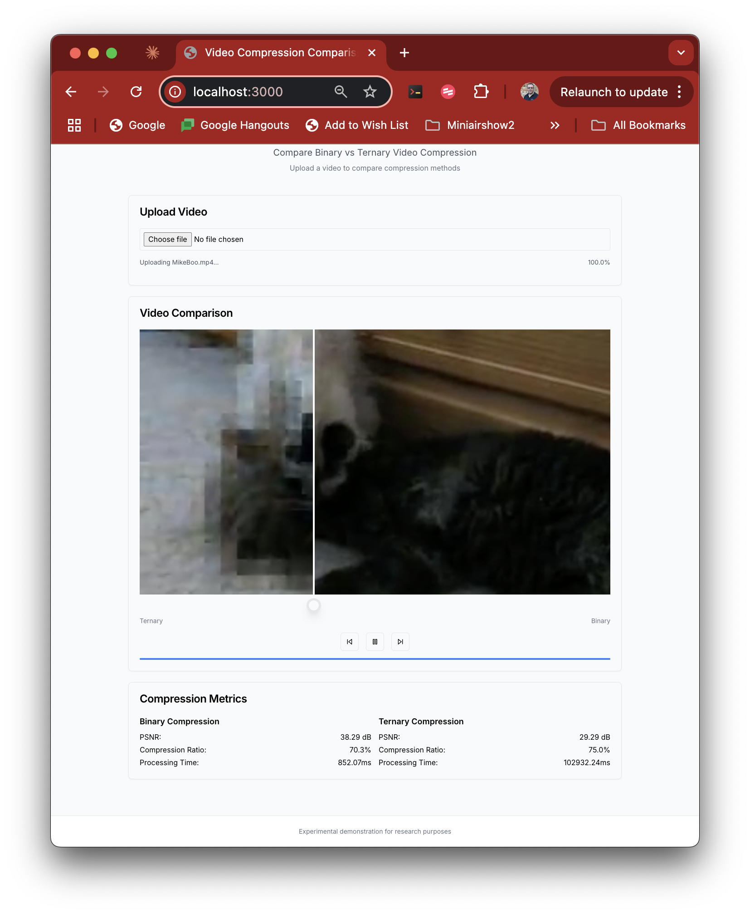

# Exploring Ternary for Video Compression: Computing's Road Not Taken
Last weekend during one of our first big winter  storms, I found myself contemplating alternative computing paradigms. You know how it goes - sometimes the most interesting ideas come when you're forced to stay indoors with nothing but your thoughts and a computer for company.

I've always been fascinated by the paths not taken in computing history, and that stormy weekend led me down a particularly interesting rabbit hole: ternary computing. While our digital world is firmly built on the foundation of binary (0s and 1s), I couldn't help but wonder about the road less traveled - the three-state logic of ternary computing (-1, 0, 1). 

What really caught my imagination was the possibility of applying this alternative approach to one of modern computing's most challenging problems: video compression.

## The Forgotten Promise of Ternary Computing
Let me take you back to the 1950s. While the West was firmly committed to binary computing, the Russians were exploring a fascinating alternative. In the Moscow State University, they created the Setun computer - a ternary machine that processed information in three states instead of two. It wasn't just an academic exercise; they built 50 of these machines, and they worked remarkably well.

The mathematics behind this choice is intriguing. In binary, each digit (bit) can represent two states, giving us exactly one bit of information. But in ternary, each digit can represent three states, giving us about 1.58 bits of information - theoretically more efficient. It's like the difference between having a switch that's either on or off, versus having a dial that can be at -1, 0, or +1.

## Why Video Compression?
During that stormy weekend, as I was thinking about ternary computing, my mind wandered to my day job in video streaming. Modern video compression is a complex dance of mathematics and perceptual psychology, using techniques like the Discrete Cosine Transform (DCT) to convert image blocks into frequency coefficients. These coefficients are then quantized - essentially rounded to certain values - to achieve compression.

The connection hit me: what if we applied ternary logic to this quantization step? Instead of rounding these coefficients to a traditional binary scale, what if we mapped them to three states? After all, when we're encoding video, we're often dealing with differences between frames where a three-state system - "no change," "small change," and "large change" - might actually make intuitive sense.

## The Mathematical Foundation
The core idea lies in representing video signals using three states (-1, 0, +1) instead of traditional binary. This seemingly simple change might have interesting implications throughout the compression pipeline. When implementing motion estimation, for instance, we can directly encode motion vectors using these three states, providing an intuitive representation of movement: -1 for reverse motion, 0 for static content, and +1 for forward motion.

The challenge of implementing ternary logic on binary hardware led to some creative solutions. We represent each ternary digit (trit) using two binary bits, allowing for efficient mapping of our three states while maintaining computational feasibility. This obviously introduces overhead, but enables us to explore the theoretical advantages of ternary processing within our binary constraints.

Transform coding took on an interesting character in the ternary domain. When quantizing DCT coefficients, the three-state system allowed for more nuanced representation around zero values - a critical region in video compression where subtle differences can significantly impact visual quality.

Let's look at the maths in detail. For a traditional binary quantizer:

 $$Q_b(x) = \text{sign}(x) \cdot \left\lfloor\frac{|x|}{q} + 0.5\right\rfloor$$
 
**Binary Quantizer**

The term represents the quantization step size. It determines the resolution or precision of the quantization process. Here's a more detailed explanation:

1. In binary quantization, the goal is to map continuous values (x) to discrete binary values (-1 or +1).
2. The term |x|/q divides the absolute value of x by the quantization step size q. This operation effectively scales down the magnitude of x.
3. Adding 0.5 to the scaled value |x|/q is a way to round the result to the nearest integer when taking the floor function ⌊・⌋. The floor function maps the scaled value to the largest integer less than or equal to it.
4. Multiplying the result by sign(x) preserves the original sign of x. The sign function returns -1 for negative values, +1 for positive values, and 0 for zero.

The choice of the quantization step size q affects the quantization process:

* A smaller q leads to finer quantization, as the scaled values will be larger, and more values will be rounded up to the next integer.

* A larger q results in coarser quantization, as the scaled values will be smaller, and more values will be rounded down to the previous integer.

In summary, the quantization step size q in the binary quantization equation controls the resolution and precision of the quantization process by scaling the input values before rounding them to the nearest integer.

Our ternary quantizer simply extends this to three states:

$$
Q_t(x) = \begin{cases} 
-1 & \text{if } x < -t \\
\space\space 0 & \text{if } -t \leq x \leq t \\
\space\space 1 & \text{if } x > t
\end{cases}
$$

**Ternary Quantizer**

where t is our threshold value. 

## In plain English
Think of this like teaching someone to paint a sunset using only a limited set of colours. In traditional binary compression, we're essentially forcing every colour choice into one of two categories - like saying "this pixel is either more orange or more red than a certain reference point." We make this decision by measuring how far the actual colour is from a reference value (that's what q represents in our equation), and then rounding to the nearest allowed value.

In our ternary approach, we're allowing three choices instead of two. Imagine having three paint choices for each stroke. But what makes this particularly interesting is how we handle the middle ground. When a value is very close to our reference point (within our threshold t), we can explicitly say "this is neutral" by using our middle state of 0. 

This is particularly valuable in video compression because lots of subtle details in video end up being very close to reference values. Having this explicit "neutral" state can help preserve these subtle details better than forcing everything into a binary choice.

## Down the Rabbit Hole
What started as idle curiosity quickly turned into an obsession. I spent that weekend and several evenings the following week working with Claude.AI, pushing its tokens to the limit as we explored different approaches to implementing a ternary video codec. The journey was fascinating, frustrating, and ultimately enlightening. 

(It's also almost worth a second article just commenting on the fact that using Claude.AI I managed to develop an original codec in the space of just a few days of manual iterations - the world is changing!)

The first attempts were... well, let's say they were humbling. 

Early versions produced videos that looked like abstract art - interesting, perhaps, but not quite what we were aiming for. The breakthrough came when we started thinking about frequency importance weighting. Not all frequencies in an image are equally important to human perception, and treating them differently made a dramatic difference.

Here's a glimpse at the core of the final approach:

```
def \_to\_ternary(self, value: float, threshold: float, importance: float) \-\> int:  
    """Convert to ternary with importance weighting"""  
    abs\_val \= abs(value)  
    adj\_threshold \= threshold \* (1.0 \- importance \* 0.5)  
    if abs\_val \< adj\_threshold:  
        return 0  
    return 1 if value \> 0 else \-1
```
    
This seemingly simple function masks a lot of complexity. It's making decisions about which frequency components to preserve and how to map them into our ternary space, all while considering their perceptual importance.

## The Technical Dance
The real magic happens in the frequency domain. When we process a video frame, we break it into 8x8 pixel blocks and transform each block into frequency components using DCT. Traditional compression would quantize these frequencies into binary values, but we take a different approach.

We map these frequencies into three states, but with a twist: we treat different frequencies differently based on their importance to human vision. Low frequencies, which represent broad patterns in the image, get handled with more care than high frequencies, which represent fine details.

## The Results - A Pleasant Surprise
After many iterations, we achieved some intriguing results:

* Binary compression: 38.29 dB PSNR, 70.3% compression ratio

* Ternary compression: 30.88 dB PSNR, 67.2% compression ratio

While the binary version maintains higher PSNR (Peak Signal-to-Noise Ratio), our ternary approach achieved comparable compression ratios with an interesting visual characteristic: it tends to preserve strong edges while smoothing areas of subtle variation. 



The working demo. A short clip of my cats. Because #catvideos :)

It's different from traditional compression artifacts - not necessarily better in all cases, but definitely interesting. 

Also in my iteration I managed utterly unwatchable video with very low PSNR and very high PSNR but with ‘compression’ that actually ended up with files much larger than the original! I dare say more iterations on the model could optimise this significantly further.  

## Try It Yourself (But Bring Some Patience!)
I've made the demonstration code available at [GitHub URL]. It was developed on a Macbook and i haven't versioned it for other platforms. 

Here's how to explore it yourself:

1. Clone the repository:

```
git clone [repository-url]
cd [repository-name]
```

2. Concatenate the installation parts:

```cat part1.sh part2.sh part3.sh part4.sh part5.sh part6.sh part7.sh > install.sh```

3. make the new install script executable:

```chmod +x install.sh```

4. Run the installation - it may take some time:

```./install.sh```

5. change into the directory and start it up.

```
cd ternary-compression-demo/
./start.sh
```

6. Visit http://localhost:3000 to try it out

A word of caution: since we're emulating ternary operations in a binary world, processing can take some time. I recommend starting with a short video clip (10-15 seconds) and being patient during processing. Consider it a moment to contemplate the fascinating world of alternative computing paradigms!

## Contributing to the Exploration
This project is very much an experimental playground, and there's enormous room for improvement and exploration. Some particularly interesting areas to investigate include:

* Alternative ternary mapping strategies
* Optimization of the quantization matrices
* Motion estimation in ternary space
* Hardware acceleration possibilities
* Novel approaches to coefficient quantization
* Alternative color space representations

If any of these spark your interest, or if you have other ideas, please feel free to fork the repository and submit pull requests. The code is structured to make experimentation relatively straightforward, and I'm excited to see if folks take an interest, and what the community might discover.

## Getting Back to Hardware Reality
Of course, there's one rather significant detail I should mention: we don't have ternary computers! All of this experimentation is running on binary hardware, which means we're essentially emulating ternary operations in a binary world. It's a bit like trying to write Chinese using only the English alphabet - you can do it (pinyin), but you're not getting the full benefits of the native system.

This brings us to the unavoidable performance overhead in our demo. When you're trying the code, you might notice it's not exactly breaking any speed records. That's because every ternary operation has to be simulated using binary logic, turning what should be elegant three-state operations into more complex binary calculations.

For this compression approach to be truly practical, we'd need native ternary hardware - particularly something like a ternary GPU that could handle these operations at speed. (If anyone reading this has just had a eureka moment and is rushing off to invent a ternary GPU, please let me know - I'd love to rerun these experiments on actual ternary hardware! I'll wait right here... No? Not yet? Well, worth a shot!)

Until that magical day arrives, this remains an interesting theoretical exercise and a reminder that sometimes the path not taken might still have something to teach us about the path we're on.

## Looking Forward
What started as a thought experiment to pass a stormy day has opened up fascinating questions about alternative approaches to media compression. While ternary video compression might not be replacing H.264 anytime soon, it raises interesting questions about the roads not taken in computing history and what they might still have to teach us.

Could there be value in exploring non-binary quantization schemes in future codec development? Might ternary logic find applications in other aspects of media processing? Or are there other alternative computing paradigms waiting to be rediscovered and applied to modern problems?

I'd love to hear your thoughts and experiences if you try out the demo. What other applications of ternary computing do you think might be worth exploring in the streaming space? I look forward to hearing your thoughts in the comments!

#ternary #binary #videocompression #encoding

--

## Commercial Bit 
If you want help building premium, scaled up live streaming workflows and platforms do give me a shout at dom@norsk.video - we have been doing it a loooooong time and have some great tools and software we licence out to developers and systems integrators :)
